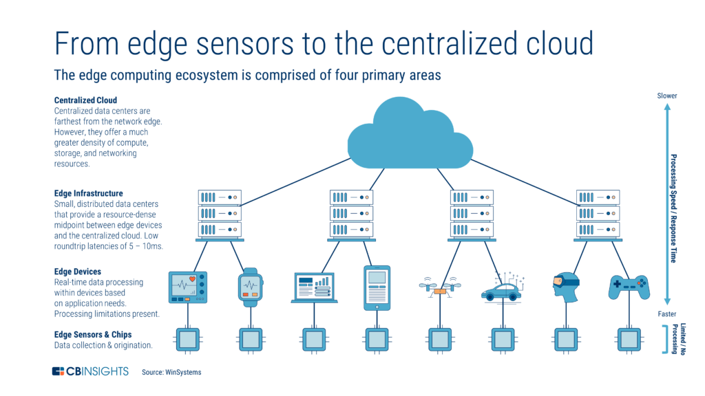
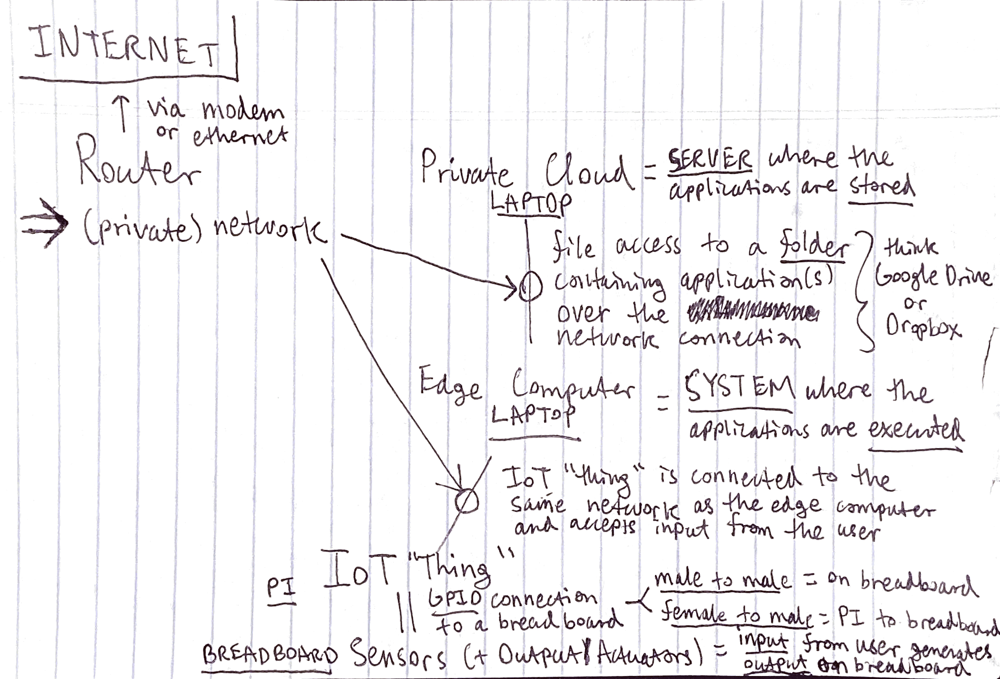

*Lorem ipsum dolor sit amet, consectetur adipiscing elit, sed do eiusmod tempor incididunt ut labore et dolore magna aliqua. Sit amet consectetur adipiscing elit. Imperdiet nulla malesuada pellentesque elit eget gravida cum sociis natoque. A iaculis at erat pellentesque adipiscing commodo elit. Ipsum nunc aliquet bibendum enim facilisis gravida neque convallis. Ante metus dictum at tempor commodo ullamcorper. Volutpat consequat mauris nunc congue nisi vitae suscipit. Facilisis sed odio morbi quis commodo odio. Justo eget magna fermentum iaculis eu non diam. Morbi non arcu risus quis varius quam quisque id. Volutpat diam ut venenatis tellus in. Tristique senectus et netus et malesuada fames ac turpis. Aenean et tortor at risus viverra adipiscing at in. Volutpat sed cras ornare arcu dui vivamus arcu.*

*Scelerisque in dictum non consectetur a erat nam. Pharetra diam sit amet nisl. Ac turpis egestas maecenas pharetra convallis posuere morbi leo urna. Nisl condimentum id venenatis a condimentum vitae. Lacus vel facilisis volutpat est velit egestas. Sit amet mauris commodo quis. Viverra aliquet eget sit amet. Duis at tellus at urna condimentum mattis. Ullamcorper dignissim cras tincidunt lobortis feugiat vivamus at augue eget. Placerat orci nulla pellentesque dignissim. Dolor magna eget est lorem ipsum dolor sit. Purus semper eget duis at tellus at urna. Mattis nunc sed blandit libero volutpat sed cras ornare arcu. Adipiscing vitae proin sagittis nisl rhoncus mattis. Feugiat in fermentum posuere urna.*

*Semper eget duis at tellus. Integer quis auctor elit sed vulputate mi sit amet. Laoreet id donec ultrices tincidunt. Diam quis enim lobortis scelerisque. Iaculis nunc sed augue lacus viverra vitae congue. Nullam vehicula ipsum a arcu cursus vitae. Ipsum dolor sit amet consectetur adipiscing. In arcu cursus euismod quis. In ornare quam viverra orci. Condimentum lacinia quis vel eros donec ac. Lobortis feugiat vivamus at augue eget arcu dictum varius. Fusce ut placerat orci nulla pellentesque dignissim enim sit. Massa ultricies mi quis hendrerit dolor magna. Sed egestas egestas fringilla phasellus faucibus scelerisque eleifend donec.*

*Featured image from:* https://innovationatwork.ieee.org/real-life-edge-computing-use-cases/